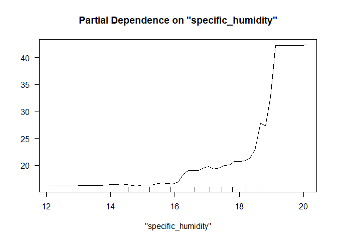
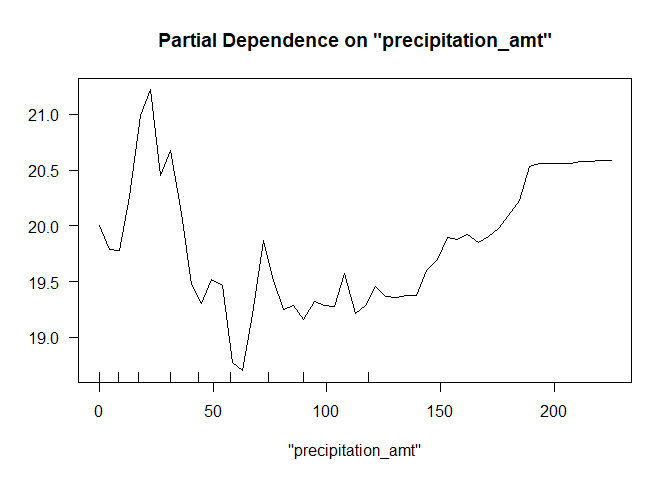
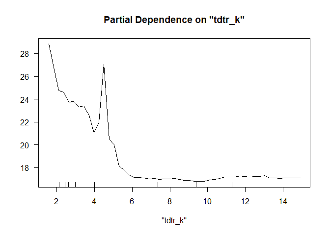
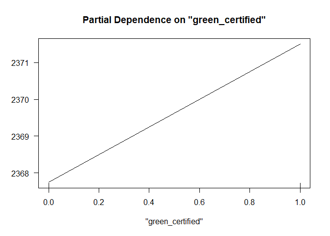
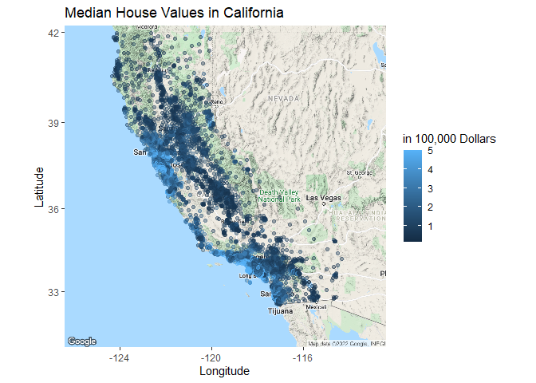
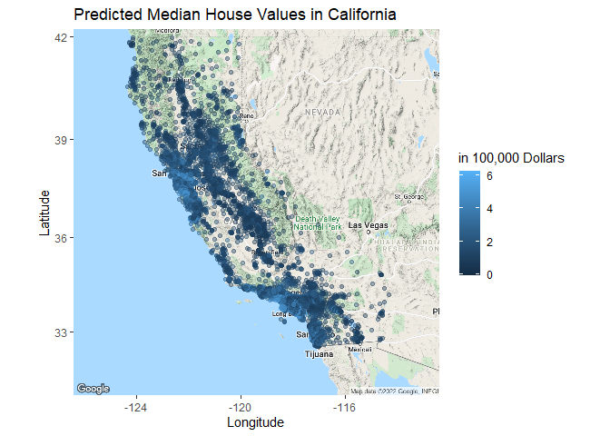
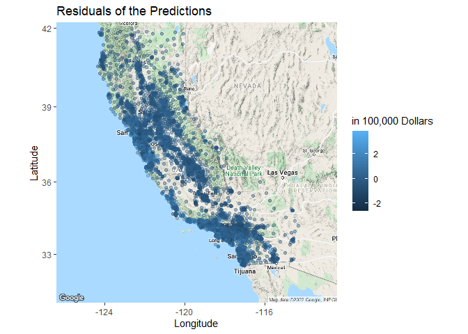

## Question 1: What causes what?

# 1. Because cities have incentives to hire more officers when there is an increase in the number of crimes, you can\`t merely obtain data from a few different cities and run regressions of “Crime” on “Police.” As a result, it may appear that “Crime” is positively connected with “Police” when there is no reason to suppose this is the case.

# 2. How were the researchers from UPenn able to isolate this effect? Briefly describe their approach and discuss their result in the “Table 2” below, from the researchers\` paper:

# The University of Pennsylvania researchers were able to isolate this effect since the District of Columbia had a strategy of increasing “Police” when there was a higher risk of terrorism, which is thought to be unrelated to street crime rates. According to the results in “Table 2,” there is a statistically significant negative association between “High Alert” and “Crime,” meaning that the increased number of officers due to the potential terrorist threat reduced crime rates. This stays true even after accounting for Metro ridership.

# 3. They had to account for Metro riding since if “crime” fell because there were fewer people on the streets, it didn’t necessarily indicate the rate of crime fell because there were more cops on the streets. If people stayed at home due to the terrorism alert, this would be a problem. It turned out, however, that this was not the case. They were attempting to capture the impact of a reduction in typical human activity on the number of criminal incidences in the city.

# 4. The model being assessed here is the effect of “High Alert,” which is regulated by districts for “Midday Ridership” (if it is district 1 or not). The finding is that “High Alert” has a substantial influence only in the first police district.

## Question 2: Tree modeling: Dengue cases

# CART

<table>
<thead>
<tr class="header">
<th style="text-align: left;"></th>
<th style="text-align: right;">Tree 1</th>
<th style="text-align: right;">Tree 2</th>
<th style="text-align: right;">Tree 3</th>
</tr>
</thead>
<tbody>
<tr class="odd">
<td style="text-align: left;">RMSE</td>
<td style="text-align: right;">30.72948</td>
<td style="text-align: right;">30.50238</td>
<td style="text-align: right;">30.25859</td>
</tr>
</tbody>
</table>

# CART, with all the training data

# First, I split the data into training and testing sets. Then, I wanted to choose the best CART model. For CART, we choose the second model with the specification of `total_cases ~ season + specific_humidity + tdtr_k + precipitation_amt` as it has the lowest in-sample cross validated rMSE. Then, I trained again the chosen model with all the training data and pruned the tree.

# Random Forest

<table>
<thead>
<tr class="header">
<th style="text-align: left;"></th>
<th style="text-align: right;">Random Forest 1</th>
<th style="text-align: right;">Random Forest 2</th>
<th style="text-align: right;">Random Forest 3</th>
</tr>
</thead>
<tbody>
<tr class="odd">
<td style="text-align: left;">RMSE</td>
<td style="text-align: right;">27.74185</td>
<td style="text-align: right;">27.52728</td>
<td style="text-align: right;">27.3224</td>
</tr>
</tbody>
</table>

# For the random forest model, we choose the third model with the specification of `total_cases ~ city + season + specific_humidity + tdtr_k + precipitation_amt` as it has the lowest in-sample cross validated rMSE. Then, I trained again the chosen model with all the training data.

# Gradient Boosting

<table>
<thead>
<tr class="header">
<th style="text-align: left;"></th>
<th style="text-align: right;">Gradient Boosted Tree 1</th>
<th style="text-align: right;">Gradient Boosted Tree 2</th>
<th style="text-align: right;">Gradient Boosted Tree 3</th>
</tr>
</thead>
<tbody>
<tr class="odd">
<td style="text-align: left;">RMSE</td>
<td style="text-align: right;">28.93198</td>
<td style="text-align: right;">29.33416</td>
<td style="text-align: right;">29.62828</td>
</tr>
</tbody>
</table>

# For the gradient boosted tree model, we again choose the third model with the specification of `total_cases ~ city + season + specific_humidity + tdtr_k + precipitation_amt` as it has the lowest in-sample cross validated rMSE. Then, I trained again the chosen model with all the training data.

<table>
<thead>
<tr class="header">
<th style="text-align: left;"></th>
<th style="text-align: right;">CART</th>
<th style="text-align: right;">Pruned</th>
<th style="text-align: right;">Ranbdom Forest</th>
<th style="text-align: right;">Boosted</th>
</tr>
</thead>
<tbody>
<tr class="odd">
<td style="text-align: left;">RMSE</td>
<td style="text-align: right;">22.12875</td>
<td style="text-align: right;">21.88867</td>
<td style="text-align: right;">20.18264</td>
<td style="text-align: right;">21.73265</td>
</tr>
</tbody>
</table>

# Out-of-sample rMSE is lowest with the random forest model. We draw the partial dependence plots on `specific_humidity`, `precipitation_amt`, and `tdtr_k` below.

# Looks like random Forest is the best and better than even the pruned tree by a slight margin

## Question 3: Predictive model building: green certification

# We started modeling with combining the LEED and EnergyStar to create a green\_certified column, which is a dummy variable that is 1 if green certified in any form and 0 otherwise. Also, we removed the nulls. Then ,we created a train/test split with 80 percent of the data being the training set data and 20 percent being the testing set data.

# Linear Regression

# Variable Selection stepwise

# In terms of the types of models, we started with a baseline linear regression model, with the specification of revenue on everything else. After that, using the stepwise variable selection function, we computed the best set of variables and the interaction between them which performed the best. The linear model chose by the stepwise function is

    `revenue ~ CS_PropertyID + cluster + size + empl_gr + 
    stories + age + renovated + class_a + class_b + green_rating + 
    net + amenities + cd_total_07 + hd_total07 + total_dd_07 + 
    Precipitation + Gas_Costs + Electricity_Costs + City_Market_Rent + 
    green_certified + size:City_Market_Rent + CS_PropertyID:City_Market_Rent + 
    size:Precipitation + stories:class_a + size:Gas_Costs + cluster:City_Market_Rent + 
    green_rating:amenities + cd_total_07:hd_total07 + age:City_Market_Rent + 
    age:total_dd_07 + renovated:Precipitation + cluster:size + 
    CS_PropertyID:total_dd_07 + Electricity_Costs:City_Market_Rent + 
    renovated:Gas_Costs + CS_PropertyID:Precipitation + stories:renovated + 
    age:class_b + hd_total07:total_dd_07 + CS_PropertyID:empl_gr + 
    size:green_rating + size:class_b + size:class_a + size:age + 
    age:Electricity_Costs + renovated:City_Market_Rent + renovated:total_dd_07 + 
    class_a:City_Market_Rent + amenities:Electricity_Costs + 
    CS_PropertyID:cd_total_07 + size:renovated + empl_gr:Gas_Costs + 
    CS_PropertyID:class_b + CS_PropertyID:class_a + CS_PropertyID:size + 
    class_a:Gas_Costs + CS_PropertyID:Electricity_Costs + CS_PropertyID:cluster + 
    class_a:hd_total07 + class_a:Electricity_Costs + age:class_a + 
    class_a:Precipitation + empl_gr:renovated + cluster:Electricity_Costs + 
    cluster:hd_total07 + size:cd_total_07 + stories:cd_total_07 + 
    size:Electricity_Costs + age:Gas_Costs + class_b:Gas_Costs + 
    stories:age + renovated:Electricity_Costs + cd_total_07:total_dd_07 + 
    age:cd_total_07 + hd_total07:Electricity_Costs + stories:Precipitation + 
    amenities:Gas_Costs + amenities:Precipitation`. 

# We decided to take both models to the final decision where we compare the out-of-sample RMSE’s.

# Next, we experimented with a tree model by considering all the variables except LEED, Energystar because LEED and Energystar is already considered under the green\_certified (tree 3). We then constructed 2 more tree models, one having all the variables and the other one without leasing\_rate, Rent, LEED and Energystar as features (tree 1 and 2). The specifications are `revenue ~ .`, `revenue ~ . - LEED - Energystar - leasing_rate - Rent`, and `revenue ~ . - LEED - Energystar` for each model 1, 2, and 3. We compared the three models with cross validated in-sample rMSE’s with the fold of 5. The table for the rMSE’s are below. As the one that takes all the variables into account has the lowest rMSE, we choose this model to take to the final decision. We then also pruned the tree to see if this would increase the performance.

# Trees

<table>
<thead>
<tr class="header">
<th style="text-align: left;"></th>
<th style="text-align: right;">Tree 1</th>
<th style="text-align: right;">Tree 2</th>
<th style="text-align: right;">Tree 3</th>
</tr>
</thead>
<tbody>
<tr class="odd">
<td style="text-align: left;">RMSE</td>
<td style="text-align: right;">1424.469</td>
<td style="text-align: right;">1411.548</td>
<td style="text-align: right;">1409.087</td>
</tr>
</tbody>
</table>

# For random forest models, we also started with three models that utilize different features as in choosing the tree model. The specifications are `revenue ~ .`, `revenue ~ . - LEED - Energystar - leasing_rate - Rent`, and `revenue ~ . - LEED - Energystar` for each model 1, 2, and 3. Out of the three models, the model which had all the variables performed the best during cross-validated in-sample performance test. The table for the rMSE’s for each forest model is below.

# Random Forest

<table>
<thead>
<tr class="header">
<th style="text-align: left;"></th>
<th style="text-align: right;">Random Forest 1</th>
<th style="text-align: right;">Random Forest 2</th>
<th style="text-align: right;">Random Forest 3</th>
</tr>
</thead>
<tbody>
<tr class="odd">
<td style="text-align: left;">RMSE</td>
<td style="text-align: right;">245.9105</td>
<td style="text-align: right;">764.8713</td>
<td style="text-align: right;">262.7351</td>
</tr>
</tbody>
</table>

# We repeated the process for gradient boosted models. We used Gradient Boosting models with distribution as “gaussian”, the number of trees as 10000, shrinkage as 0.01,and with a interaction depth of 4. Out of the three models, the model which had all the variables performed the best during cross-validated in-sample performance test. The table for the rMSE’s for each boosted model is below.

# Gradient Boosting

<table>
<thead>
<tr class="header">
<th style="text-align: left;"></th>
<th style="text-align: right;">Boosted 1</th>
<th style="text-align: right;">Boosted 2</th>
<th style="text-align: right;">Boosted 3</th>
</tr>
</thead>
<tbody>
<tr class="odd">
<td style="text-align: left;">RMSE</td>
<td style="text-align: right;">308.4842</td>
<td style="text-align: right;">933.1532</td>
<td style="text-align: right;">310.6479</td>
</tr>
</tbody>
</table>

# We repeat the process for knn models. Out of the same three models, the model which had all the variables except for `LEED, Energystar, leasing_rate,` and `Rent` with `k = 5` performed the best during cross-validated in-sample performance test. The table for the rMSE’s for each boosted model is below.

# knn model

<table>
<thead>
<tr class="header">
<th style="text-align: left;"></th>
<th style="text-align: right;">knn 1</th>
<th style="text-align: right;">knn 2</th>
<th style="text-align: right;">knn 3</th>
</tr>
</thead>
<tbody>
<tr class="odd">
<td style="text-align: left;">k</td>
<td style="text-align: right;">5.000</td>
<td style="text-align: right;">5.00</td>
<td style="text-align: right;">5.000</td>
</tr>
<tr class="even">
<td style="text-align: left;">RMSE</td>
<td style="text-align: right;">1232.338</td>
<td style="text-align: right;">1259.02</td>
<td style="text-align: right;">1241.669</td>
</tr>
</tbody>
</table>

# In the end, we trained the chosen models with all the training data and the out-of sample rmse values. The table for this is below.

<table>
<thead>
<tr class="header">
<th style="text-align: left;"></th>
<th style="text-align: right;">Linear</th>
<th style="text-align: right;">Stepwise</th>
<th style="text-align: right;">Tree</th>
<th style="text-align: right;">Pruned Tree</th>
<th style="text-align: right;">Forest</th>
<th style="text-align: right;">GBM</th>
<th style="text-align: right;">knn</th>
</tr>
</thead>
<tbody>
<tr class="odd">
<td style="text-align: left;">RMSE</td>
<td style="text-align: right;">1049.059</td>
<td style="text-align: right;">1021.217</td>
<td style="text-align: right;">1520.936</td>
<td style="text-align: right;">371.9207</td>
<td style="text-align: right;">184.2861</td>
<td style="text-align: right;">139.0999</td>
<td style="text-align: right;">1120.071</td>
</tr>
</tbody>
</table>

# Since the random forest model performed the best, we decided to draw a partial dependence plot on `green_certified` with this. As seen in the graph below, a green\_certified building generates 3 dollars more in revenue on average compared to a non green\_certified building per square foot per year.

## Question 4: Predictive model building: California housing

    ## Start:  AIC=371124.5
    ## medianHouseValue ~ (longitude + latitude + housingMedianAge + 
    ##     totalRooms + totalBedrooms + population + households + medianIncome) - 
    ##     longitude - latitude
    ## 
    ##                                  Df  Sum of Sq        RSS    AIC
    ## + totalBedrooms:medianIncome      1 3.1532e+12 9.2051e+13 370570
    ## + households:medianIncome         1 3.0438e+12 9.2160e+13 370590
    ## + totalRooms:medianIncome         1 2.2990e+12 9.2905e+13 370723
    ## + population:medianIncome         1 1.3951e+12 9.3809e+13 370883
    ## + housingMedianAge:totalBedrooms  1 8.1631e+11 9.4388e+13 370984
    ## + housingMedianAge:households     1 7.8400e+11 9.4420e+13 370990
    ## + totalRooms:population           1 2.4289e+11 9.4961e+13 371084
    ## + housingMedianAge:totalRooms     1 2.2367e+11 9.4980e+13 371088
    ## + totalBedrooms:households        1 1.7169e+11 9.5032e+13 371097
    ## + population:households           1 8.9097e+10 9.5115e+13 371111
    ## + totalBedrooms:population        1 6.2004e+10 9.5142e+13 371116
    ## <none>                                         9.5204e+13 371124
    ## + totalRooms:totalBedrooms        1 7.1956e+09 9.5197e+13 371125
    ## + housingMedianAge:medianIncome   1 4.4136e+09 9.5199e+13 371126
    ## + totalRooms:households           1 7.1604e+08 9.5203e+13 371126
    ## + housingMedianAge:population     1 4.1371e+08 9.5203e+13 371126
    ## - totalBedrooms                   1 8.4939e+11 9.6053e+13 371269
    ## - households                      1 1.1544e+12 9.6358e+13 371321
    ## - totalRooms                      1 2.7566e+12 9.7960e+13 371594
    ## - population                      1 4.1396e+12 9.9343e+13 371825
    ## - housingMedianAge                1 8.0673e+12 1.0327e+14 372466
    ## - medianIncome                    1 9.0361e+13 1.8556e+14 382142
    ## 
    ## Step:  AIC=370570.3
    ## medianHouseValue ~ housingMedianAge + totalRooms + totalBedrooms + 
    ##     population + households + medianIncome + totalBedrooms:medianIncome
    ## 
    ##                                  Df  Sum of Sq        RSS    AIC
    ## + housingMedianAge:totalBedrooms  1 9.9782e+11 9.1053e+13 370392
    ## + housingMedianAge:households     1 9.8296e+11 9.1068e+13 370395
    ## + housingMedianAge:totalRooms     1 5.0365e+11 9.1547e+13 370482
    ## + population:medianIncome         1 3.0392e+11 9.1747e+13 370518
    ## + totalBedrooms:households        1 2.0468e+11 9.1846e+13 370536
    ## + totalRooms:population           1 1.6961e+11 9.1881e+13 370542
    ## + population:households           1 1.1658e+11 9.1934e+13 370551
    ## + housingMedianAge:medianIncome   1 1.1606e+11 9.1935e+13 370552
    ## + totalBedrooms:population        1 9.0918e+10 9.1960e+13 370556
    ## + totalRooms:totalBedrooms        1 6.0849e+10 9.1990e+13 370561
    ## + totalRooms:households           1 4.6118e+10 9.2005e+13 370564
    ## + totalRooms:medianIncome         1 2.9556e+10 9.2021e+13 370567
    ## <none>                                         9.2051e+13 370570
    ## + households:medianIncome         1 8.9905e+09 9.2042e+13 370571
    ## + housingMedianAge:population     1 5.0196e+09 9.2046e+13 370571
    ## - households                      1 6.8807e+11 9.2739e+13 370691
    ## - population                      1 3.0530e+12 9.5104e+13 371107
    ## - totalBedrooms:medianIncome      1 3.1532e+12 9.5204e+13 371124
    ## - totalRooms                      1 5.8613e+12 9.7912e+13 371588
    ## - housingMedianAge                1 7.4020e+12 9.9453e+13 371845
    ## 
    ## Step:  AIC=370392.4
    ## medianHouseValue ~ housingMedianAge + totalRooms + totalBedrooms + 
    ##     population + households + medianIncome + totalBedrooms:medianIncome + 
    ##     housingMedianAge:totalBedrooms
    ## 
    ##                                  Df  Sum of Sq        RSS    AIC
    ## + housingMedianAge:population     1 2.1227e+12 8.8930e+13 370005
    ## + totalRooms:population           1 7.9839e+11 9.0254e+13 370249
    ## + population:households           1 6.1942e+11 9.0433e+13 370282
    ## + totalBedrooms:population        1 6.1066e+11 9.0442e+13 370283
    ## + population:medianIncome         1 3.1800e+11 9.0735e+13 370337
    ## + housingMedianAge:totalRooms     1 2.5525e+11 9.0798e+13 370348
    ## + housingMedianAge:medianIncome   1 1.8102e+11 9.0872e+13 370362
    ## + totalRooms:households           1 1.0754e+11 9.0945e+13 370375
    ## + totalRooms:totalBedrooms        1 9.7741e+10 9.0955e+13 370377
    ## + totalRooms:medianIncome         1 9.0583e+10 9.0962e+13 370378
    ## <none>                                         9.1053e+13 370392
    ## + totalBedrooms:households        1 3.3986e+09 9.1049e+13 370394
    ## + housingMedianAge:households     1 2.4108e+09 9.1050e+13 370394
    ## + households:medianIncome         1 9.7220e+07 9.1053e+13 370394
    ## - households                      1 4.4797e+11 9.1501e+13 370471
    ## - housingMedianAge:totalBedrooms  1 9.9782e+11 9.2051e+13 370570
    ## - population                      1 2.8161e+12 9.3869e+13 370893
    ## - totalBedrooms:medianIncome      1 3.3347e+12 9.4388e+13 370984
    ## - totalRooms                      1 4.3189e+12 9.5372e+13 371156
    ## 
    ## Step:  AIC=370004.9
    ## medianHouseValue ~ housingMedianAge + totalRooms + totalBedrooms + 
    ##     population + households + medianIncome + totalBedrooms:medianIncome + 
    ##     housingMedianAge:totalBedrooms + housingMedianAge:population
    ## 
    ##                                  Df  Sum of Sq        RSS    AIC
    ## + housingMedianAge:households     1 4.7506e+11 8.8455e+13 369918
    ## + population:medianIncome         1 3.0076e+11 8.8629e+13 369951
    ## + housingMedianAge:medianIncome   1 1.8446e+11 8.8746e+13 369973
    ## + totalRooms:population           1 1.3575e+11 8.8794e+13 369982
    ## + totalRooms:medianIncome         1 1.1086e+11 8.8819e+13 369986
    ## + totalBedrooms:population        1 7.3551e+10 8.8857e+13 369993
    ## + population:households           1 6.5121e+10 8.8865e+13 369995
    ## + totalBedrooms:households        1 4.5570e+10 8.8885e+13 369998
    ## + housingMedianAge:totalRooms     1 2.8849e+10 8.8901e+13 370002
    ## + households:medianIncome         1 1.3160e+10 8.8917e+13 370004
    ## <none>                                         8.8930e+13 370005
    ## + totalRooms:totalBedrooms        1 6.6117e+09 8.8924e+13 370006
    ## + totalRooms:households           1 4.1471e+08 8.8930e+13 370007
    ## - households                      1 1.1898e+11 8.9049e+13 370025
    ## - housingMedianAge:population     1 2.1227e+12 9.1053e+13 370392
    ## - housingMedianAge:totalBedrooms  1 3.1155e+12 9.2046e+13 370571
    ## - totalBedrooms:medianIncome      1 3.4977e+12 9.2428e+13 370640
    ## - totalRooms                      1 5.1235e+12 9.4054e+13 370928
    ## 
    ## Step:  AIC=369918.4
    ## medianHouseValue ~ housingMedianAge + totalRooms + totalBedrooms + 
    ##     population + households + medianIncome + totalBedrooms:medianIncome + 
    ##     housingMedianAge:totalBedrooms + housingMedianAge:population + 
    ##     housingMedianAge:households
    ## 
    ##                                  Df  Sum of Sq        RSS    AIC
    ## + population:medianIncome         1 1.8198e+11 8.8273e+13 369886
    ## + housingMedianAge:medianIncome   1 1.4616e+11 8.8309e+13 369893
    ## + totalRooms:population           1 1.1388e+11 8.8341e+13 369899
    ## + totalRooms:medianIncome         1 8.4353e+10 8.8371e+13 369905
    ## + population:households           1 5.9465e+10 8.8396e+13 369909
    ## + totalBedrooms:population        1 5.5781e+10 8.8399e+13 369910
    ## + totalBedrooms:households        1 3.9422e+10 8.8416e+13 369913
    ## + housingMedianAge:totalRooms     1 2.9508e+10 8.8426e+13 369915
    ## - housingMedianAge:totalBedrooms  1 3.1621e+09 8.8458e+13 369917
    ## <none>                                         8.8455e+13 369918
    ## + households:medianIncome         1 3.9101e+09 8.8451e+13 369920
    ## + totalRooms:households           1 1.2415e+09 8.8454e+13 369920
    ## + totalRooms:totalBedrooms        1 6.6360e+08 8.8454e+13 369920
    ## - housingMedianAge:households     1 4.7506e+11 8.8930e+13 370005
    ## - housingMedianAge:population     1 2.5953e+12 9.1050e+13 370394
    ## - totalBedrooms:medianIncome      1 3.6276e+12 9.2083e+13 370580
    ## - totalRooms                      1 5.4029e+12 9.3858e+13 370895
    ## 
    ## Step:  AIC=369886.4
    ## medianHouseValue ~ housingMedianAge + totalRooms + totalBedrooms + 
    ##     population + households + medianIncome + totalBedrooms:medianIncome + 
    ##     housingMedianAge:totalBedrooms + housingMedianAge:population + 
    ##     housingMedianAge:households + population:medianIncome
    ## 
    ##                                  Df  Sum of Sq        RSS    AIC
    ## + housingMedianAge:medianIncome   1 1.3495e+11 8.8138e+13 369863
    ## + households:medianIncome         1 1.0182e+11 8.8171e+13 369869
    ## + totalRooms:population           1 1.0110e+11 8.8172e+13 369870
    ## + housingMedianAge:totalRooms     1 5.6302e+10 8.8217e+13 369878
    ## + totalBedrooms:households        1 4.0953e+10 8.8232e+13 369881
    ## + population:households           1 3.9612e+10 8.8234e+13 369881
    ## + totalBedrooms:population        1 3.6472e+10 8.8237e+13 369882
    ## + totalRooms:medianIncome         1 3.2194e+10 8.8241e+13 369882
    ## - housingMedianAge:totalBedrooms  1 3.9668e+08 8.8274e+13 369885
    ## <none>                                         8.8273e+13 369886
    ## + totalRooms:households           1 1.8330e+09 8.8271e+13 369888
    ## + totalRooms:totalBedrooms        1 8.5433e+08 8.8272e+13 369888
    ## - population:medianIncome         1 1.8198e+11 8.8455e+13 369918
    ## - housingMedianAge:households     1 3.5628e+11 8.8629e+13 369951
    ## - totalBedrooms:medianIncome      1 1.9527e+12 9.0226e+13 370246
    ## - housingMedianAge:population     1 2.4596e+12 9.0733e+13 370338
    ## - totalRooms                      1 4.8293e+12 9.3102e+13 370764
    ## 
    ## Step:  AIC=369863.2
    ## medianHouseValue ~ housingMedianAge + totalRooms + totalBedrooms + 
    ##     population + households + medianIncome + totalBedrooms:medianIncome + 
    ##     housingMedianAge:totalBedrooms + housingMedianAge:population + 
    ##     housingMedianAge:households + population:medianIncome + housingMedianAge:medianIncome
    ## 
    ##                                  Df  Sum of Sq        RSS    AIC
    ## + housingMedianAge:totalRooms     1 2.2640e+11 8.7912e+13 369823
    ## + totalRooms:population           1 9.9699e+10 8.8038e+13 369846
    ## + households:medianIncome         1 7.9893e+10 8.8058e+13 369850
    ## + population:households           1 4.0319e+10 8.8098e+13 369858
    ## + totalBedrooms:population        1 3.8110e+10 8.8100e+13 369858
    ## + totalBedrooms:households        1 3.7621e+10 8.8101e+13 369858
    ## + totalRooms:medianIncome         1 2.3402e+10 8.8115e+13 369861
    ## - housingMedianAge:totalBedrooms  1 2.2127e+09 8.8140e+13 369862
    ## <none>                                         8.8138e+13 369863
    ## + totalRooms:households           1 1.6933e+09 8.8136e+13 369865
    ## + totalRooms:totalBedrooms        1 1.0866e+09 8.8137e+13 369865
    ## - housingMedianAge:medianIncome   1 1.3495e+11 8.8273e+13 369886
    ## - population:medianIncome         1 1.7078e+11 8.8309e+13 369893
    ## - housingMedianAge:households     1 3.2831e+11 8.8466e+13 369923
    ## - totalBedrooms:medianIncome      1 2.0342e+12 9.0172e+13 370238
    ## - housingMedianAge:population     1 2.4327e+12 9.0571e+13 370311
    ## - totalRooms                      1 4.8268e+12 9.2965e+13 370742
    ## 
    ## Step:  AIC=369822.7
    ## medianHouseValue ~ housingMedianAge + totalRooms + totalBedrooms + 
    ##     population + households + medianIncome + totalBedrooms:medianIncome + 
    ##     housingMedianAge:totalBedrooms + housingMedianAge:population + 
    ##     housingMedianAge:households + population:medianIncome + housingMedianAge:medianIncome + 
    ##     housingMedianAge:totalRooms
    ## 
    ##                                  Df  Sum of Sq        RSS    AIC
    ## + households:medianIncome         1 1.3390e+11 8.7778e+13 369800
    ## + totalBedrooms:households        1 6.4591e+10 8.7847e+13 369813
    ## + totalRooms:medianIncome         1 6.2592e+10 8.7849e+13 369813
    ## + totalRooms:population           1 6.1114e+10 8.7851e+13 369813
    ## + population:households           1 3.2069e+10 8.7880e+13 369819
    ## + totalBedrooms:population        1 2.6418e+10 8.7885e+13 369820
    ## <none>                                         8.7912e+13 369823
    ## + totalRooms:totalBedrooms        1 6.4956e+09 8.7905e+13 369823
    ## + totalRooms:households           1 3.9467e+09 8.7908e+13 369824
    ## - housingMedianAge:totalBedrooms  1 5.8892e+10 8.7971e+13 369832
    ## - housingMedianAge:totalRooms     1 2.2640e+11 8.8138e+13 369863
    ## - population:medianIncome         1 2.2996e+11 8.8142e+13 369864
    ## - housingMedianAge:households     1 2.9354e+11 8.8205e+13 369876
    ## - housingMedianAge:medianIncome   1 3.0504e+11 8.8217e+13 369878
    ## - housingMedianAge:population     1 1.8885e+12 8.9800e+13 370172
    ## - totalBedrooms:medianIncome      1 2.1083e+12 9.0020e+13 370212
    ## 
    ## Step:  AIC=369799.5
    ## medianHouseValue ~ housingMedianAge + totalRooms + totalBedrooms + 
    ##     population + households + medianIncome + totalBedrooms:medianIncome + 
    ##     housingMedianAge:totalBedrooms + housingMedianAge:population + 
    ##     housingMedianAge:households + population:medianIncome + housingMedianAge:medianIncome + 
    ##     housingMedianAge:totalRooms + households:medianIncome
    ## 
    ##                                  Df  Sum of Sq        RSS    AIC
    ## + totalRooms:medianIncome         1 8.6266e+10 8.7692e+13 369785
    ## + totalBedrooms:households        1 6.7627e+10 8.7710e+13 369789
    ## + totalRooms:population           1 5.1134e+10 8.7727e+13 369792
    ## + population:households           1 2.5422e+10 8.7752e+13 369797
    ## + totalBedrooms:population        1 2.0961e+10 8.7757e+13 369798
    ## <none>                                         8.7778e+13 369800
    ## + totalRooms:totalBedrooms        1 8.5299e+09 8.7769e+13 369800
    ## + totalRooms:households           1 6.3044e+09 8.7772e+13 369800
    ## - housingMedianAge:totalBedrooms  1 3.5151e+10 8.7813e+13 369804
    ## - totalBedrooms:medianIncome      1 8.2631e+10 8.7861e+13 369813
    ## - households:medianIncome         1 1.3390e+11 8.7912e+13 369823
    ## - housingMedianAge:totalRooms     1 2.8040e+11 8.8058e+13 369850
    ## - housingMedianAge:medianIncome   1 3.0059e+11 8.8078e+13 369854
    ## - population:medianIncome         1 3.6001e+11 8.8138e+13 369865
    ## - housingMedianAge:households     1 3.6023e+11 8.8138e+13 369865
    ## - housingMedianAge:population     1 1.8168e+12 8.9595e+13 370136
    ## 
    ## Step:  AIC=369785.3
    ## medianHouseValue ~ housingMedianAge + totalRooms + totalBedrooms + 
    ##     population + households + medianIncome + totalBedrooms:medianIncome + 
    ##     housingMedianAge:totalBedrooms + housingMedianAge:population + 
    ##     housingMedianAge:households + population:medianIncome + housingMedianAge:medianIncome + 
    ##     housingMedianAge:totalRooms + households:medianIncome + totalRooms:medianIncome
    ## 
    ##                                  Df  Sum of Sq        RSS    AIC
    ## + totalBedrooms:households        1 6.2522e+10 8.7629e+13 369776
    ## + totalRooms:population           1 5.5511e+10 8.7636e+13 369777
    ## + population:households           1 2.9453e+10 8.7662e+13 369782
    ## + totalBedrooms:population        1 2.4626e+10 8.7667e+13 369783
    ## <none>                                         8.7692e+13 369785
    ## + totalRooms:totalBedrooms        1 7.9032e+09 8.7684e+13 369786
    ## + totalRooms:households           1 5.4920e+09 8.7686e+13 369786
    ## - housingMedianAge:totalBedrooms  1 4.6306e+10 8.7738e+13 369792
    ## - totalRooms:medianIncome         1 8.6266e+10 8.7778e+13 369800
    ## - totalBedrooms:medianIncome      1 1.2930e+11 8.7821e+13 369808
    ## - households:medianIncome         1 1.5757e+11 8.7849e+13 369813
    ## - population:medianIncome         1 2.9721e+11 8.7989e+13 369839
    ## - housingMedianAge:medianIncome   1 3.1002e+11 8.8002e+13 369842
    ## - housingMedianAge:totalRooms     1 3.3583e+11 8.8027e+13 369846
    ## - housingMedianAge:households     1 3.6141e+11 8.8053e+13 369851
    ## - housingMedianAge:population     1 1.7826e+12 8.9474e+13 370116
    ## 
    ## Step:  AIC=369775.5
    ## medianHouseValue ~ housingMedianAge + totalRooms + totalBedrooms + 
    ##     population + households + medianIncome + totalBedrooms:medianIncome + 
    ##     housingMedianAge:totalBedrooms + housingMedianAge:population + 
    ##     housingMedianAge:households + population:medianIncome + housingMedianAge:medianIncome + 
    ##     housingMedianAge:totalRooms + households:medianIncome + totalRooms:medianIncome + 
    ##     totalBedrooms:households
    ## 
    ##                                  Df  Sum of Sq        RSS    AIC
    ## + totalRooms:population           1 8.1389e+11 8.6815e+13 369623
    ## + totalBedrooms:population        1 7.6964e+11 8.6859e+13 369632
    ## + population:households           1 6.9447e+11 8.6935e+13 369646
    ## + totalRooms:households           1 3.8379e+11 8.7245e+13 369705
    ## + totalRooms:totalBedrooms        1 2.2647e+11 8.7403e+13 369735
    ## <none>                                         8.7629e+13 369776
    ## - housingMedianAge:totalBedrooms  1 4.8123e+10 8.7677e+13 369783
    ## - totalBedrooms:households        1 6.2522e+10 8.7692e+13 369785
    ## - totalRooms:medianIncome         1 8.1160e+10 8.7710e+13 369789
    ## - totalBedrooms:medianIncome      1 1.2585e+11 8.7755e+13 369797
    ## - households:medianIncome         1 1.5994e+11 8.7789e+13 369804
    ## - population:medianIncome         1 3.0709e+11 8.7936e+13 369831
    ## - housingMedianAge:medianIncome   1 3.2036e+11 8.7949e+13 369834
    ## - housingMedianAge:households     1 3.5336e+11 8.7982e+13 369840
    ## - housingMedianAge:totalRooms     1 3.6502e+11 8.7994e+13 369842
    ## - housingMedianAge:population     1 1.8381e+12 8.9467e+13 370116
    ## 
    ## Step:  AIC=369623.4
    ## medianHouseValue ~ housingMedianAge + totalRooms + totalBedrooms + 
    ##     population + households + medianIncome + totalBedrooms:medianIncome + 
    ##     housingMedianAge:totalBedrooms + housingMedianAge:population + 
    ##     housingMedianAge:households + population:medianIncome + housingMedianAge:medianIncome + 
    ##     housingMedianAge:totalRooms + households:medianIncome + totalRooms:medianIncome + 
    ##     totalBedrooms:households + totalRooms:population
    ## 
    ##                                  Df  Sum of Sq        RSS    AIC
    ## + totalBedrooms:population        1 1.4888e+10 8.6800e+13 369623
    ## <none>                                         8.6815e+13 369623
    ## + totalRooms:totalBedrooms        1 8.3952e+09 8.6807e+13 369624
    ## + totalRooms:households           1 7.3979e+09 8.6808e+13 369624
    ## + population:households           1 3.9237e+09 8.6811e+13 369625
    ## - housingMedianAge:totalBedrooms  1 2.4851e+10 8.6840e+13 369626
    ## - totalRooms:medianIncome         1 8.3151e+10 8.6898e+13 369637
    ## - households:medianIncome         1 1.0159e+11 8.6917e+13 369641
    ## - totalBedrooms:medianIncome      1 1.4398e+11 8.6959e+13 369649
    ## - population:medianIncome         1 1.9439e+11 8.7010e+13 369658
    ## - housingMedianAge:households     1 2.3459e+11 8.7050e+13 369666
    ## - housingMedianAge:medianIncome   1 2.3474e+11 8.7050e+13 369666
    ## - housingMedianAge:totalRooms     1 2.6177e+11 8.7077e+13 369671
    ## - housingMedianAge:population     1 7.4711e+11 8.7562e+13 369763
    ## - totalRooms:population           1 8.1389e+11 8.7629e+13 369776
    ## - totalBedrooms:households        1 8.2090e+11 8.7636e+13 369777
    ## 
    ## Step:  AIC=369622.6
    ## medianHouseValue ~ housingMedianAge + totalRooms + totalBedrooms + 
    ##     population + households + medianIncome + totalBedrooms:medianIncome + 
    ##     housingMedianAge:totalBedrooms + housingMedianAge:population + 
    ##     housingMedianAge:households + population:medianIncome + housingMedianAge:medianIncome + 
    ##     housingMedianAge:totalRooms + households:medianIncome + totalRooms:medianIncome + 
    ##     totalBedrooms:households + totalRooms:population + totalBedrooms:population
    ## 
    ##                                  Df  Sum of Sq        RSS    AIC
    ## + totalRooms:households           1 2.0147e+11 8.6599e+13 369586
    ## + totalRooms:totalBedrooms        1 6.6364e+10 8.6734e+13 369612
    ## + population:households           1 1.1398e+10 8.6789e+13 369622
    ## <none>                                         8.6800e+13 369623
    ## - totalBedrooms:population        1 1.4888e+10 8.6815e+13 369623
    ## - housingMedianAge:totalBedrooms  1 3.0947e+10 8.6831e+13 369626
    ## - totalRooms:population           1 5.9140e+10 8.6859e+13 369632
    ## - totalRooms:medianIncome         1 8.6369e+10 8.6887e+13 369637
    ## - households:medianIncome         1 1.0255e+11 8.6903e+13 369640
    ## - totalBedrooms:medianIncome      1 1.4276e+11 8.6943e+13 369648
    ## - population:medianIncome         1 1.5213e+11 8.6952e+13 369650
    ## - housingMedianAge:households     1 2.2606e+11 8.7026e+13 369664
    ## - housingMedianAge:medianIncome   1 2.4948e+11 8.7050e+13 369668
    ## - housingMedianAge:totalRooms     1 2.6766e+11 8.7068e+13 369671
    ## - housingMedianAge:population     1 6.6749e+11 8.7468e+13 369747
    ## - totalBedrooms:households        1 7.0058e+11 8.7501e+13 369753
    ## 
    ## Step:  AIC=369586.2
    ## medianHouseValue ~ housingMedianAge + totalRooms + totalBedrooms + 
    ##     population + households + medianIncome + totalBedrooms:medianIncome + 
    ##     housingMedianAge:totalBedrooms + housingMedianAge:population + 
    ##     housingMedianAge:households + population:medianIncome + housingMedianAge:medianIncome + 
    ##     housingMedianAge:totalRooms + households:medianIncome + totalRooms:medianIncome + 
    ##     totalBedrooms:households + totalRooms:population + totalBedrooms:population + 
    ##     totalRooms:households
    ## 
    ##                                  Df  Sum of Sq        RSS    AIC
    ## <none>                                         8.6599e+13 369586
    ## + population:households           1 9.5276e+08 8.6598e+13 369588
    ## + totalRooms:totalBedrooms        1 4.3718e+08 8.6598e+13 369588
    ## - housingMedianAge:totalBedrooms  1 3.2179e+10 8.6631e+13 369590
    ## - population:medianIncome         1 4.0307e+10 8.6639e+13 369592
    ## - households:medianIncome         1 6.1975e+10 8.6661e+13 369596
    ## - totalRooms:medianIncome         1 6.8105e+10 8.6667e+13 369597
    ## - totalRooms:population           1 1.0976e+11 8.6709e+13 369605
    ## - totalBedrooms:medianIncome      1 1.3238e+11 8.6731e+13 369609
    ## - totalRooms:households           1 2.0147e+11 8.6800e+13 369623
    ## - totalBedrooms:population        1 2.0896e+11 8.6808e+13 369624
    ## - housingMedianAge:medianIncome   1 2.2564e+11 8.6824e+13 369627
    ## - housingMedianAge:totalRooms     1 2.4846e+11 8.6847e+13 369632
    ## - housingMedianAge:households     1 2.5062e+11 8.6849e+13 369632
    ## - totalBedrooms:households        1 3.9755e+11 8.6996e+13 369660
    ## - housingMedianAge:population     1 7.9094e+11 8.7390e+13 369734

# Random Forest

# plotcp(CAhousing.tree)

# Gradient Boosting

<table>
<thead>
<tr class="header">
<th style="text-align: left;"></th>
<th style="text-align: right;">Linear</th>
<th style="text-align: right;">Stepwise</th>
<th style="text-align: right;">Tree</th>
<th style="text-align: right;">Pruned Tree</th>
<th style="text-align: right;">Forest</th>
<th style="text-align: right;">GBM</th>
</tr>
</thead>
<tbody>
<tr class="odd">
<td style="text-align: left;">RMSE</td>
<td style="text-align: right;">76091.32</td>
<td style="text-align: right;">72551.67</td>
<td style="text-align: right;">78491.91</td>
<td style="text-align: right;">78620.41</td>
<td style="text-align: right;">65284.18</td>
<td style="text-align: right;">65069.85</td>
</tr>
</tbody>
</table>

# We choose the gradiented boosted model that has `housingMedianAge`, `totalRooms`, `totalBedrooms`, `population`, `households`, and `medianIncome` as the features. The plots are below.

